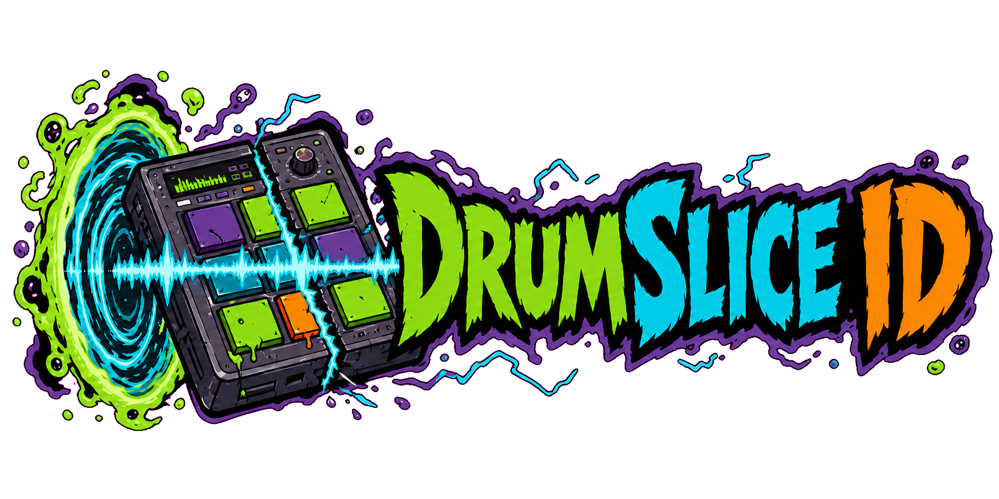
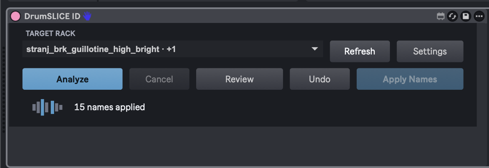

# DrumSLICE ID for Ableton



[](https://github.com/sjfbo/drumslice-id/actions/workflows/ci.yml)
[](LICENSE)



Built for the annoying part of chopping breaks: a Drum Rack full of pads called *Slice 1*, *Slice 2*, *Slice 3*.

DrumSLICE ID listens to the slices already in the rack and suggests useful names such as kick, snare, hi-hat, tom, and cymbal. It does not move markers or touch the audio. You see the naming plan first, and nothing is written until you press **Apply Names**.

**Analyze → Review → Apply Names.** Weak or unsupported hits are left alone instead of being forced into a category.

> **Alpha:** `0.1.0-alpha.1` is ready for testing, not irreplaceable sessions. Back up important Live Sets and read the classifier license note below.

## Install

Download the current archive and `SHA256SUMS` from [Releases](https://github.com/sjfbo/drumslice-id/releases), then extract it.

You will need Ableton Live 12 with Max for Live, Git, and CPython 3.10–3.12. The backend installer also needs an internet connection and enough space for a private PyTorch environment.

On macOS:

```sh
./install.sh --accept-adtof-license
```

On Windows PowerShell:

```powershell
powershell -ExecutionPolicy Bypass -File .\install.ps1 -AcceptAdtofLicense
```

Restart Live or rescan the User Library. The device will appear under:

```text
User Library > Presets > MIDI Effects > Max MIDI Effect > DrumSLICE ID
```

Put it immediately before the sliced Drum Rack on the same MIDI track. Choose the rack, press **Analyze**, review the result, then apply the names you want.

The installer copies everything into user-owned locations, verifies the installation, and prints the paths it used. The extracted archive can be deleted afterward. Custom locations and verification-only installs are supported; run `./install.sh --help` or `Get-Help .\install.ps1 -Detailed` for the full list of options.

Want the device without the classifier backend? Use `--skip-backend` on macOS or `-SkipBackend` on Windows. The interface will load, but analysis will remain unavailable until a backend is configured.

See the [user guide](docs/USER_GUIDE.md) for settings, layered breaks, REX files, conflict handling, and uninstall instructions.

## What changes in your Live Set?

Only Drum Rack chain names. DrumSLICE ID reads the existing Simpler sources and slice regions, analyzes each unique audio source once, and prepares a dry-run result. Applying a result writes `Chain.name` and reads it back to verify the change. **Undo** restores the last batch where those names have not since been edited by hand.

Audio files, slice markers, devices, pads, MIDI, and routing are not changed.

## Classification and licensing

The current alpha uses an external ADTOF-based PyTorch backend. It aligns five drum-activation streams with the rack's real slice starts, then keeps the dominant class only when the evidence is strong enough. The displayed scores help compare classes; they are not calibrated probabilities.

The code in this repository is MIT-licensed. The optional backend is downloaded separately because ADTOF is licensed CC BY-NC-SA 4.0, while the pinned PyTorch port does not publish a separate license for its code or converted weights. Neither ADTOF code nor model weights are included here or in the release archive.

For now, treat a backend-equipped installation as **free, noncommercial, experimental software**. The installer asks you to acknowledge that before downloading it. Read [Third-party notices](THIRD_PARTY_NOTICES.md) for the pinned revision and exact status.

## Development

For an editable local install:

```sh
./scripts/install_local.sh
```

Open `max/DrumSliceID.maxproj` in Max and rebuild the generated bundles after source changes. Copying `dist/DrumSLICE ID.amxd` by itself is not enough; the device also resolves files from the `DrumSliceID` Max package.

Start with [Contributing](CONTRIBUTING.md), then use the [technical reference](docs/TECHNICAL_REFERENCE.md) and [architecture notes](docs/ARCHITECTURE.md) when working on classification or the Max/Node/Python bridge. Known rough edges are tracked in [Known limitations](KNOWN_LIMITATIONS.md).

Bug reports are welcome. For ordinary problems, see [Support](SUPPORT.md). Please use the process in [Security](SECURITY.md) for security issues.
