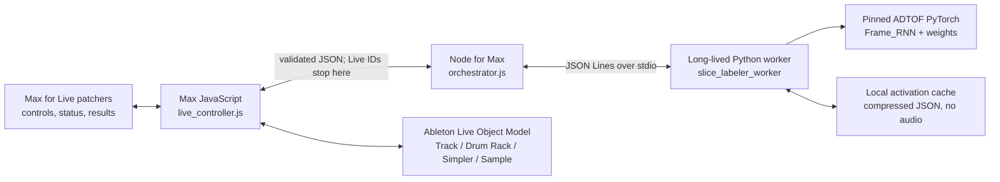
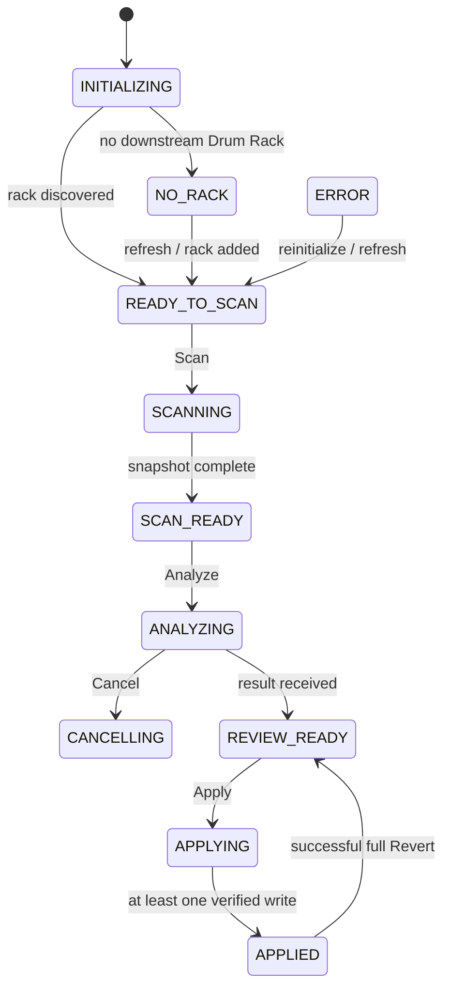
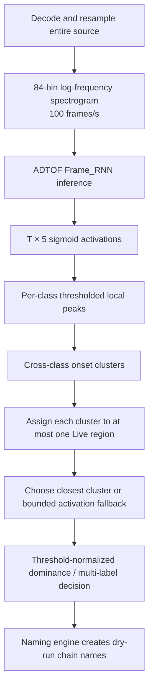

# Slice Labeler technical reference

This document describes the implementation that is committed in this repository. It is intended for maintainers, reviewers, and anyone who needs to understand why a slice received a particular label. The most important distinction is this:

> ADTOF produces five continuous frame-activation streams for an entire audio source. Slice Labeler, not ADTOF, decides which onset belongs to which Live slice and which class names are finally retained.

The device is deliberately a labeler, not a slicer. It reads the regions already represented by the Simplers in a Drum Rack, analyzes their shared source audio, builds a reviewable dry-run plan, and writes only Drum Rack chain names after the user presses **Apply**. It does not move slice markers, replace samples, create MIDI notes, or modify audio.

## 1. System topology



There are four runtime boundaries:

1. The Max patchers own presentation, control routing, dictionaries, and unconditional MIDI pass-through.
2. [`live_controller.js`](../max/javascript/live_controller.js) is the only component that traverses the Live Object Model or mutates a Live Set. Its only write operation is `Chain.name`.
3. [`orchestrator.js`](../max/node/orchestrator.js) validates and reduces the Live snapshot, fingerprints source files, supervises Python, and correlates requests and responses.
4. The Python package in [`python/slice_labeler_worker`](../python/slice_labeler_worker) performs audio inference, activation caching, event extraction, onset clustering, and slice classification.

This separation is a safety boundary as well as an implementation choice. The Python process never receives a Live object ID and therefore cannot write to Live. The model backend never needs to know what a Drum Rack, pad, chain, or Simpler is.

## 2. Technology stack

| Layer | Technology | Responsibility |
| --- | --- | --- |
| Host | Ableton Live 12, Max for Live, Max 9 package format | Device hosting, Live Set state, MIDI device chain |
| Device UI | Max patchers (`.maxpat`) packaged behind an `.amxd` | Controls, settings and results windows, progress/status display, MIDI pass-through |
| Live integration | Max `js`, ES5-compatible JavaScript, `LiveAPI`, `Task`, `Dict` | Drum Rack discovery, snapshot construction, dry-run plan, guarded Apply/Revert |
| Orchestration | Node for Max, CommonJS, Node 18+, `max-api` | Validation, grouping, SHA-256 source identity, process supervision, logging |
| Analysis service | Python 3.10+ standard library | JSON-Lines protocol, backend lifetime, cancellation, caching, mapping |
| ML inference | `adtof-pytorch` 0.1.0 at Git commit `85c192e78f716ea0b111cc8a5ee4a8f6a3a4f8a9` | Audio preprocessing and five-class Frame_RNN inference |
| ML dependencies | PyTorch, librosa, NumPy; SoundFile/audioread through librosa; PrettyMIDI in the ADTOF package | Tensor inference, decoding/resampling, STFT and numeric operations; Slice Labeler itself does not export MIDI |
| Test stack | Node's built-in test runner and pytest | Pure graph/naming/protocol tests and Python inference/mapping regressions |

The ADTOF dependency is a Git-revision pin in [`python/pyproject.toml`](../python/pyproject.toml), not a loose “latest” dependency. The backend reports a model identity, preprocessing identity, and SHA-256 weights fingerprint before analysis. Those values participate in cache identity, so a changed model or weights file cannot silently reuse old activations.

The repository commits the Max package source and the development `.amxd`, but it does not commit a Python virtual environment, third-party model code, or model weights. [`setup_backend.sh`](../scripts/setup_backend.sh) and [`setup_backend.ps1`](../scripts/setup_backend.ps1) install those dependencies explicitly. See [Packaging and installation](#14-packaging-and-installation) for the distinction between the committed device and the installed backend.

## 3. Runtime lifecycle and state machine

The main controller uses an explicit state set:



Any operation can transition to `ERROR` when its required invariant fails. A new scan cancels an active analysis. Apply is only accepted from `REVIEW_READY`; Analyze is only accepted from `SCAN_READY`. This prevents a stale button press from bypassing the intended Scan → Analyze → Review → Apply sequence.

Cancellation is cooperative. The worker checks cancellation before each unique source and before returning the final result. A PyTorch inference already executing for one source is not interrupted in the middle.

## 4. Discovering the target Drum Rack

On initialization, the controller resolves `this_device canonical_parent` and requires that object to be a Live `Track`. It then reads the track's device list, finds this device's position, and offers only devices after Slice Labeler whose `can_have_drum_pads` property is true.

Consequences:

- Slice Labeler must be placed on the same MIDI track and before the target Drum Rack.
- Upstream racks are intentionally ignored.
- Multiple downstream Drum Racks are supported through the **Target Rack** menu.
- Discovery uses the current Live object ID when possible and the canonical `devices N` path index as a fallback for a short Live/Max initialization race.
- Selecting another rack invalidates the previous snapshot and plan.

The target is a top-level downstream Drum Rack. Nested instrument/effect racks inside each pad are traversed only to find a reachable Simpler.

## 5. Scan: converting Live state into authoritative regions

Scan reads the selected rack's top-level `drum_pads`. Empty pads are ignored. A populated pad is analyzable only if it has exactly one top-level chain and that chain contains exactly one reachable `SimplerDevice` within eight nested rack levels.

For each candidate, the controller rejects:

- pads with multiple chains;
- chains with no reachable Simpler;
- chains with more than one reachable Simpler;
- Simpler multisample mode;
- a Simpler that does not expose exactly one `Sample` object;
- a missing backing-file path;
- invalid sample rate, sample length, or marker bounds.

The scan reads the following authoritative values from Live:

- pad index, MIDI note, and display name;
- chain ID, canonical path, and original name;
- Simpler canonical path and playback mode;
- `Sample.file_path`, `sample_rate`, `length`, `start_marker`, and `end_marker`.

The resulting snapshot conforms to [`rack_snapshot.schema.json`](../max/schemas/rack_snapshot.schema.json). A region ID is a SHA-256 digest over the scan job ID, pad note, chain ID, source path, start marker, and end marker. It is opaque outside the Live controller; it is a correlation key, not a durable identity across scans.

Skipped pads remain visible in scan diagnostics with a stable reason code. They are not silently converted to unknown predictions and are never included in Apply.

### Shared-source grouping

A sliced rack commonly has many Simplers pointing to the same break. Node groups all regions by normalized absolute source path and analyzes each unique file once. Every group must report one consistent sample rate from Live.

The source ID used for activation caching is:

```text
SHA256(
  normalized_absolute_path NUL
  file_size NUL
  nanosecond_mtime NUL
  backend_id NUL
  model_version NUL
  model_weights_sha256 NUL
  preprocessing_version
)
```

Changing a slice marker does not invalidate expensive whole-file inference, because markers affect mapping rather than model output. Changing the audio file, model, weights, or preprocessing does invalidate inference. Threshold and mapping changes can therefore reuse the same cached activations.

## 6. Data contracts and trust boundaries

The complete rack snapshot contains session-only Live IDs and source paths. It stays in Max/Node memory unless the user explicitly exports diagnostics. Before calling Python, Node strips each region to:

```json
{
  "regionId": "opaque correlation token",
  "startFrame": 12345,
  "endFrame": 23456
}
```

Python receives groups containing only the source ID, source path, Live-reported sample rate, reduced regions, model settings, and mapping settings. It receives no chain ID, rack ID, Live path, or original/proposed name. The JSON schemas in [`max/schemas`](../max/schemas) define the version-1 snapshot, request, and result envelopes.

All messages between Node and Python are newline-delimited compact JSON on stdin/stdout. Human-readable logs and tracebacks go to stderr. The ADTOF weight loader prints to stdout, so the adapter captures that output during initialization to prevent third-party text from corrupting the protocol stream.

## 7. Classification pipeline at a glance

For every unique source, classification proceeds as follows:



The five output classes are fixed and asserted at backend load time:

| Output index | ADTOF MIDI label | Slice Labeler class | Default event threshold |
| ---: | ---: | --- | ---: |
| 0 | 35 | kick | 0.22 |
| 1 | 38 | snare | 0.24 |
| 2 | 47 | tom | 0.32 |
| 3 | 42 | hihat | 0.22 |
| 4 | 49 | cymbal | 0.30 |

If the installed backend reports another label order, loading fails with `BACKEND_CLASS_MAPPING_CHANGED`. There is no implicit guess based on MIDI note number.

These are broad drum families. The model does not expose separate open/closed hi-hat, ride/crash, rim, clap, or percussion labels. A five-channel output also means an overlapping break transient can legitimately activate more than one channel.

## 8. ADTOF audio preprocessing

The pinned ADTOF PyTorch port performs its own librosa-based front end. Slice Labeler calls `load_audio_for_model()` with the production defaults:

1. `librosa.load` decodes the file, mixes it to mono, and resamples it to 44,100 Hz.
2. No peak-amplitude normalization is applied (`normalize=False`).
3. A centered STFT is computed with a 2,048-sample Hann window, a 2,048-point FFT, constant zero padding, and a 441-sample hop. Since `44100 / 100 = 441`, the temporal grid is exactly 100 frames/s, or 10 ms per frame.
4. Only the first 1,024 magnitude bins are retained.
5. Target frequencies are generated geometrically from 20 Hz through 20 kHz at 12 bands per octave.
6. Each target is mapped to its nearest unique FFT bin. Triangular, madmom-style filters are formed from successive mapped bins and normalized so each filter sums to one.
7. Duplicate low-frequency FFT mappings collapse during the unique-bin step, producing 84 usable filterbank bands for these defaults.
8. The projected magnitude is compressed as `log10(1 + magnitude)` and converted to `float32`.

The model input tensor is shaped `[1, T, 84, 1]`: batch, time, frequency, channel. `T` is determined by the decoded source duration and centered-STFT padding.

This front end is log-frequency, but it is not librosa's standard mel-spectrogram helper. It is a dedicated reconstruction of the filterbank behavior expected by the converted ADTOF weights. That distinction matters when reproducing results in another tool.

## 9. Frame_RNN model internals

The loaded network is `ADTOFFrameRNN`, evaluated on CPU under `torch.inference_mode()`. The reliable prototype path intentionally rejects CUDA and any FPS other than 100. The user-configurable thread count is clamped to 1–8 and applied through `torch.set_num_threads`; its default is 2.

### 9.1 Convolutional feature extractor

The tensor is permuted to PyTorch image order `[batch, 1, T, 84]` and passed through two blocks:

```text
Block 1:
  Conv2d 1→32, 3×3, same padding → ReLU → BatchNorm(eps=0.001)
  Conv2d 32→32, 3×3, same padding → ReLU → BatchNorm(eps=0.001)
  frequency-only MaxPool 1×3, stride 1×3, Keras-style same padding
  Dropout2d 0.3

Block 2:
  Conv2d 32→64, 3×3, same padding → ReLU → BatchNorm(eps=0.001)
  Conv2d 64→64, 3×3, same padding → ReLU → BatchNorm(eps=0.001)
  frequency-only MaxPool 1×3, stride 1×3, Keras-style same padding
  Dropout2d 0.3
```

Frequency width changes `84 → 28 → 10`; time length is preserved. The resulting 64 × 10 values are flattened into 640 features per frame. Dropout is disabled by `model.eval()` during inference.

Four same-padded temporal convolutions give the CNN a nine-frame local receptive field. The model configuration also declares a context of nine; because that receptive field already supplies the requested context, no additional frame-concatenation layer is created in this configuration.

### 9.2 Recurrent and output layers

The 640-feature sequence is passed through three bidirectional GRU layers:

```text
BiGRU 1: input 640, hidden 60 in each direction → 120 features/frame
BiGRU 2: input 120, hidden 60 in each direction → 120 features/frame
BiGRU 3: input 120, hidden 60 in each direction → 120 features/frame
Linear: 120 → 5
Sigmoid: independently applied to all five outputs
```

The standard production configuration has 449,741 trainable parameters. Bidirectionality means inference is non-causal: an activation at one frame can depend on audio both before and after that frame. It is designed for offline whole-file analysis, not real-time streaming.

The installed weights are the PyTorch port's bundled `adtof_frame_rnn_pytorch_weights.pth`. The third-party package describes them as converted from the original Keras/TensorFlow ADTOF Frame_RNN. Slice Labeler computes the file's SHA-256 digest at load time and returns that digest in backend health metadata.

The classifier is not trained by this repository. It is the pinned [ADTOF PyTorch port at the exact installed revision](https://github.com/xavriley/ADTOF-pytorch/tree/85c192e78f716ea0b111cc8a5ee4a8f6a3a4f8a9), whose package metadata identifies it as a port of the ADTOF work by Zehren, Alunno, and Bientinesi. The converted pretrained weights and their learned dataset biases are therefore third-party model behavior; Slice Labeler's project-owned contribution begins at backend validation and continues through event extraction, slice mapping, review, and safe application. Licensing and attribution are recorded in [`THIRD_PARTY_NOTICES.md`](../THIRD_PARTY_NOTICES.md).

### 9.3 What the output values mean

The output is a matrix `A` with shape `[T, 5]`. Each value is sigmoid-bounded in `[0, 1]` and represents onset activation strength for one drum family around one 10 ms frame.

The channels are independent, not a softmax distribution:

- they do not sum to one;
- two or more classes can be strong at the same transient;
- a high value is confidence-like model evidence, not a calibrated probability that the entire slice belongs to that class;
- the raw magnitudes are only comparable after accounting for the class-specific thresholds used during model development.

Slice Labeler caches this activation matrix. It does **not** call ADTOF's convenience function that writes a MIDI file, and it does **not** use the third-party `PeakPicker` in the runtime mapping path. The repository's [`events.py`](../python/slice_labeler_worker/events.py) and [`mapping.py`](../python/slice_labeler_worker/mapping.py) define the actual classification behavior.

## 10. From frame activations to slice labels

This stage is where Slice Labeler adapts a whole-song drum transcription model to pre-existing Live slice boundaries.

### 10.1 Per-class event extraction

For class `c`, frame `i` is an event candidate when:

```text
A[i,c] >= threshold[c]
and
A[i,c] >= max(A[j,c]) for j in [i - 20 ms, i + 10 ms]
```

At 100 FPS, the local-maximum window is two frames before through one frame after, clipped at source boundaries. Candidate events for the same class that are no more than 20 ms apart are combined; only the stronger candidate survives. Event time is `frame_index / 100`, and its score is the unnormalized activation at that frame.

Unlike the third-party ADTOF MIDI peak picker, this extractor does not subtract a moving activation average. The checked-in event code is the source of truth.

### 10.2 Cross-class onset clustering

All class events are sorted by time. Consecutive events separated by at most the configured cluster window—18 ms by default—are grouped. Grouping is transitive: a sequence of short adjacent gaps can produce a cluster whose first-to-last span is greater than 18 ms.

Within a cluster:

- each class score is the maximum score among that class's events;
- the cluster timestamp is the activation-score-weighted mean of all event timestamps;
- multiple drum classes are preserved for the later dominance decision.

This is how a kick and hi-hat detected around one physical break transient become one candidate onset rather than competing timestamps.

### 10.3 Assigning clusters to Live regions

For a region starting at `s` and ending at `e`, a cluster at `t` is eligible when:

```text
t >= s - preTolerance
t <= s + postTolerance
t < e
```

Defaults are 35 ms before and 90 ms after the slice start. If a cluster is eligible for multiple nearby regions, it is assigned to exactly one: the region with the closest start time, with the earlier start winning an exact tie. This one-owner rule prevents one onset from labeling two adjacent slices.

If several clusters are assigned to one region, the closest cluster to the region start supplies the class scores. The prediction records all matched clusters and warns that later clusters existed, but those later clusters do not alter the generated label.

### 10.4 Threshold-normalized dominance

Raw activation values are normalized by each class's configured threshold:

```text
normalized[class] = raw_score[class] / threshold[class]
```

The highest normalized class is the dominant class. A label is retained only when its normalized value reaches the floor. Matched event clusters use a fixed floor of 0.70. The fallback path uses the configurable **Fallback normalized floor**, also 0.70 by default.

With **Multi-label** enabled, a secondary class survives only when both conditions hold:

```text
normalized[secondary] >= floor
normalized[top] - normalized[secondary] <= 0.15
```

Therefore “multi-label” does not mean “include every channel above threshold.” It retains only near-tied evidence. This is intentional for breakbeats: overlapping hats and room bleed are common, but a clearly dominant snare should not become `K+S+HH` merely because weaker channels are nonzero.

Normalized-score ties use the backend class order: kick, snare, tom, hi-hat, cymbal. The result's `topScore` field is the maximum **raw** score, while class selection uses normalized scores.

### 10.5 Bounded activation fallback

Peak extraction can miss a quiet, clipped, or boundary-smeared transient. If no cluster is assigned and fallback is enabled, Slice Labeler examines raw activations near the slice start:

```text
fallback start = max(0, slice start - 20 ms)
fallback end   = min(
  slice end - 20 ms,
  slice start + 100 ms,
  model output duration
)
```

For each class, the maximum raw activation in that interval is normalized and passed through the same dominance rule. If the interval is empty or the dominant class is below the floor, the slice becomes `unknown`.

Stopping 20 ms before the slice end is a deliberate anti-bleed rule. Onset networks smear evidence slightly before a transient; without this guard, a strong kick at the beginning of slice 7 can be pulled backward and incorrectly label a short or quiet slice 6 as kick. The regression test in [`test_events_mapping.py`](../tests/python/test_events_mapping.py) covers this failure mode and also asserts that a clearly dominant class suppresses weaker overlap labels.

### 10.6 Prediction decisions

Every analyzed region has one decision code:

- `matched_event`: an extracted and assigned onset cluster supplied the scores;
- `activation_fallback`: no cluster matched, but bounded raw activation passed the floor;
- `unknown`: neither path produced sufficient evidence;
- `analysis_error`: the source failed, while other source groups were allowed to finish.

Per-source failures are intentionally partial. Every region from a failed source becomes `unknown` with an error warning, rather than discarding valid predictions for other source files.

## 11. REX/RX2 companion handling

Live can use REX/RX2 files directly, but the pinned librosa pipeline cannot decode them. For `.rex` and `.rx2`, the backend searches for a same-stem directly decodable companion with one of these extensions:

```text
.wav .wave .aif .aiff .flac .mp3 .m4a
```

It first checks the REX file's directory. On macOS only, if no local companion exists and `mdfind` is available, it searches the user's home directory and chooses the path with the closest common ancestry, then lexical order as a deterministic tie-break.

Live's marker frames still refer to the REX source. When a companion is used, the worker calculates:

```text
live_duration = maximum region end frame / Live sample rate
scale = decoded companion activation duration / live_duration
scaled marker frame = round(original marker frame × scale)
```

Ratios outside 0.1–10 are rejected as incompatible. A successful prediction receives a warning that companion audio was analyzed. This mechanism aligns time; it does not prove that two same-stem files contain identical audio. Users should keep the matching rendered WAV/AIFF beside the REX file whenever possible.

REX/RX2 activation caching is disabled because the normal source fingerprint describes the REX file, not whichever companion was discovered. Re-running inference is safer than reusing activations from a companion that may have moved or changed.

## 12. Naming engine and review plan

The Python result contains semantic classes, scores, decision codes, and warnings. Max then generates names without touching Live.

Canonical naming order is:

```text
kick, snare, hi-hat, tom, cymbal
```

The short tokens are `K`, `S`, `HH`, `T`, `CY`, and `UNK`; long-name mode uses `Kick`, `Snare`, `Hi-Hat`, `Tom`, `Cymbal`, and `Unknown`. Multi-label tokens use `+`, for example `K+HH`.

Numbering modes are:

- `off`: never append an index;
- `duplicates` (default): append a two-digit index only when the same token occurs more than once;
- `always`: append a two-digit index to every generated name.

Names are whitespace-normalized and limited to 31 characters. Long tokens are shortened before hard truncation. **Preserve names for unknown** causes an unknown row to retain the original chain name.

The Results window shows pad note, current name, effective proposed name, classes, raw scores, decision, and row status. A user can edit a proposed name, keep the original for one row, or reset edits. These actions alter the in-memory plan only. `exportdiagnostics` is the explicit path that writes snapshot/plan/diagnostic JSON to a user-selected file.

## 13. Apply and Revert safety

Apply is a guarded write phase, not a continuation of inference. Before scheduling any writes, the controller re-resolves every chain and requires:

- the remembered chain still exists;
- recursive traversal still finds exactly one Simpler;
- that Simpler still exposes exactly one Sample;
- source path and sample rate still match the scan;
- start and end markers still match the scan;
- the current chain name still equals the analyzed original name, unless overwrite conflicts was explicitly enabled.

Any structural or source/marker mismatch makes the entire plan stale and stops Apply before the first write. A name conflict is row-local: by default that row is marked `conflict` while non-conflicting rows can proceed.

Writes run in a deferred Max `Task`, set only the chain `name`, and immediately read it back. A row is considered applied only when readback exactly matches the requested value. Apply can therefore finish partially; it does not perform an automatic transactional rollback after a later row fails.

The last successful Apply records each old and applied name in memory. **Revert Last Apply** is compare-and-swap-like: it restores a row only if the chain and sample identity are still valid and the current chain name still equals the name Slice Labeler wrote. If the user renamed that chain afterward, Revert leaves it alone. Revert is best-effort and can also be partial.

No other Live property is written anywhere in the codebase.

## 14. Packaging and installation

The project has two separately installable pieces.

### Max device and package

[`dist/Slice Labeler.amxd`](../dist/Slice%20Labeler.amxd) is the committed development device. The implementation modules, patchers, schemas, Node scripts, and generated Max-compatible JavaScript bundles are committed under [`max`](../max). [`install_local.sh`](../scripts/install_local.sh):

1. symlinks the repository's `max` directory to `~/Documents/Max 9/Packages/SliceLabeler`; and
2. copies the `.amxd` to the Ableton User Library.

The `.amxd` is not a fully frozen archive containing Python, PyTorch, ADTOF, and weights. It resolves the installed `SliceLabeler` Max package at runtime. This makes source edits and local reinstallation straightforward and keeps large third-party artifacts out of Git.

The source patchers use small loader scripts plus generated bundles in [`max/patchers`](../max/patchers). [`build_max_js_bundle.js`](../scripts/build_max_js_bundle.js) rebuilds those Max-compatible bundles from the source JavaScript modules when required.

### Python backend

The backend installer creates `~/.slice-labeler/venv`, installs the local worker with its pinned `adtof` optional dependency, performs a health check, and writes `~/.slice-labeler/backend-config.json` containing the selected Python executable. The Node layer resolves Python in this order:

1. `SLICE_LABELER_BACKEND_CONFIG`;
2. `~/.slice-labeler/backend-config.json`;
3. `SLICE_LABELER_PYTHON`.

The Settings window can override the Python executable for the current device process through **Backend Python path**. That field should point to the virtual environment's executable (for example `~/.slice-labeler/venv/bin/python`), not to a folder containing audio or Max files.

Loading the device never downloads or installs backend software. Backend setup is an explicit user action.

## 15. Process supervision, timeouts, and recovery

Node starts one long-lived Python child with `python -m slice_labeler_worker`. Keeping the process alive avoids re-importing PyTorch and reloading weights for every Analyze operation. Backend instances are reused by backend ID and inference-relevant model options; threshold-only changes do not reload the model.

The protocol supports `health`, `request/analyze`, `progress`, `cancel`, and `shutdown` envelopes, all at schema version 1. Node validates envelopes, correlates them by request ID, and ignores messages for unknown requests.

Defaults:

- backend health timeout: 15 seconds;
- analysis timeout: 300 seconds per unique source;
- graceful shutdown window: 2 seconds before process termination;
- one automatic retry for an in-flight analysis request if the worker crashes.

Unexpected Python exceptions are printed to stderr and returned publicly as a generic `INTERNAL_WORKER_ERROR` with the exception type. Expected failures use stable error codes and user-oriented messages.

## 16. Cache, logs, privacy, and local storage

Production activations are cached by Python as gzip-compressed JSON under the platform cache directory:

- macOS: `~/Library/Caches/Slice Labeler/worker`;
- Windows: `%LOCALAPPDATA%/Slice Labeler/Cache/worker`;
- Linux: `$XDG_CACHE_HOME/slice-labeler/worker` or `~/.cache/slice-labeler/worker`.

Each entry contains FPS, class names, the activation matrix, source duration, and backend metadata. It contains no audio samples and no Live object IDs. Writes use a temporary file followed by atomic replacement. Corrupt entries are deleted on read. Least-recently-accessed files are removed when compressed entries exceed 512 MiB.

Node's cache root also contains `slice-labeler.log`. Logs rotate at 1 MiB with three backups, use owner-only file mode where supported, and redact common absolute home-path forms from structured detail payloads. The **Clear Cache** action removes the cache root recursively, including the Python `worker` subdirectory; subsequent logging recreates its directory.

Source file paths necessarily cross the Node/Python boundary so the local decoder can open them. Nothing in the device sends audio, paths, activations, or labels over a network. Network access is needed only during the explicit backend installation step that fetches dependencies.

## 17. Settings and their exact effects

| Setting | Default | Runtime effect |
| --- | ---: | --- |
| Multi-label | on | Allows secondary classes only when within 0.15 normalized score of the dominant class |
| Pre-tolerance | 35 ms | How far before a slice start an extracted cluster may match |
| Post-tolerance | 90 ms | How far after a slice start an extracted cluster may match |
| Cluster window | 18 ms | Maximum gap between consecutive class events in one onset cluster |
| Activation fallback | on | Enables bounded raw-activation classification when no peak cluster matches |
| Fallback normalized floor | 0.70 | Minimum dominant normalized score for fallback only |
| Numbering | duplicates | Adds two-digit indexes when generated tokens repeat |
| Long class names | off | Uses words instead of compact tokens |
| Preserve names for unknown | off | Keeps the original chain name when classification is unknown |
| Maximum Torch CPU threads | 2 | Passed to PyTorch after clamping to 1–8 |
| Kick threshold | 0.22 | Event threshold and normalization denominator for kick |
| Snare threshold | 0.24 | Event threshold and normalization denominator for snare |
| Tom threshold | 0.32 | Event threshold and normalization denominator for tom |
| Hi-hat threshold | 0.22 | Event threshold and normalization denominator for hi-hat |
| Cymbal threshold | 0.30 | Event threshold and normalization denominator for cymbal |

Changing thresholds affects three things at once: which per-class events are extracted, how raw scores are normalized for dominance, and whether fallback reaches its normalized floor. Lowering one class threshold therefore makes that class both easier to peak-pick and stronger after normalization. Threshold tuning should be treated as class calibration, not just a global sensitivity control.

## 18. Testing strategy

The automated suites are split at the process boundary:

- Node tests cover Live graph/value helpers, naming, protocol framing/validation, cache/log behavior, source grouping/fingerprinting, orchestration, cancellation, and worker error handling.
- Python tests cover event extraction, clustering, one-owner region assignment, fallback behavior, cache reuse/invalidation, protocol behavior, backend health/error paths, RX2 companion scaling, and partial source failures.

Run them from the repository root:

```sh
npm test --prefix max/node
PYTHONPATH=python pytest -q tests/python
```

The pure automated tests do not prove that a particular Ableton/Max version exposes identical LiveAPI properties. [`LIVE_12_TEST_CHECKLIST.md`](../tests/manual/LIVE_12_TEST_CHECKLIST.md) is the manual integration checklist for rack discovery, nested Simpler traversal, UI behavior, Apply/Revert, stale plans, conflicts, cancellation, and installation.

## 19. Known limitations and extension points

- Classification is restricted to five broad ADTOF families. Adding a class requires a new backend class contract, thresholds, naming token, schema enum, UI control, and tests.
- CPU inference at 100 FPS is the only supported production model configuration.
- The entire unique source file is decoded and inferred even if the rack uses only a small subset of it.
- REX/RX2 depends on a same-stem decodable companion and duration-ratio alignment; it does not decode REX directly or compare waveforms.
- Very short regions can have an empty anti-bleed fallback window and become unknown.
- Bidirectional inference is offline and cannot drive real-time labeling while audio plays.
- Apply is guarded and verified but not fully transactional across rows.
- Session object IDs and opaque region IDs are not durable across Live Set reloads or rescans.

The backend interface in [`backends/base.py`](../python/slice_labeler_worker/backends/base.py) is the intended model extension point. A replacement backend must return a `ModelOutput` containing FPS, an ordered class tuple, frame activations, source duration, and metadata. Any material model/preprocessing change must also change the reported identity so cached activations cannot cross the compatibility boundary.

For user-visible behavior and recovery steps, see the [User Guide](USER_GUIDE.md) and [Troubleshooting](TROUBLESHOOTING.md). For design constraints and accepted trade-offs, see [`DECISIONS.md`](../DECISIONS.md), [`KNOWN_LIMITATIONS.md`](../KNOWN_LIMITATIONS.md), and [`THIRD_PARTY_NOTICES.md`](../THIRD_PARTY_NOTICES.md).
